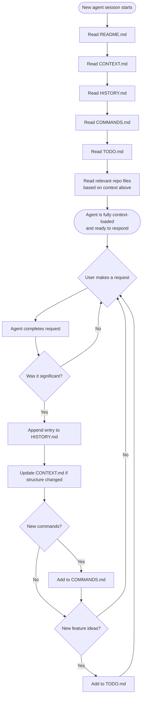
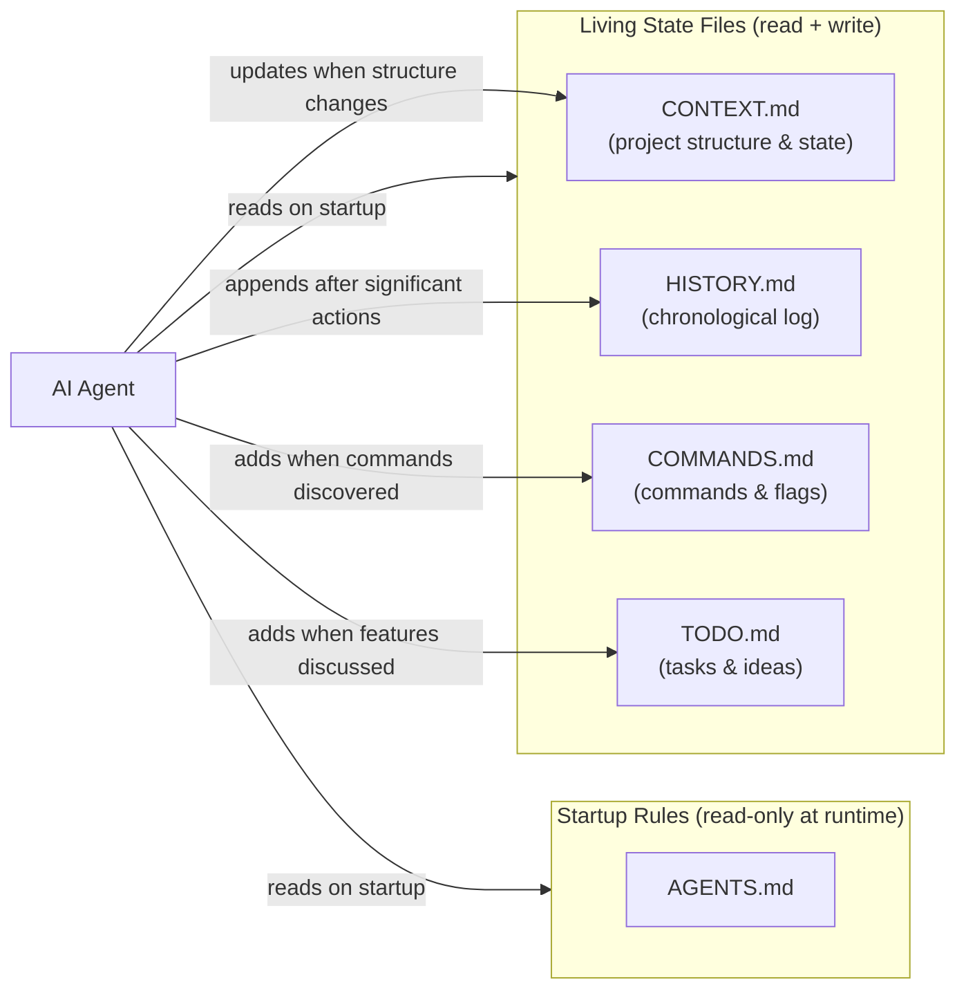

# Agent Rules

## On Every Conversation Start

*If any file below does not exist, create it before proceeding.*

You MUST do the following at the start of every conversation, before responding to the user:

1. Read `README.md` to get the project overview.
2. Read `CONTEXT.md` to load current project context.
3. Read `HISTORY.md` to understand what has been done previously.
4. Read `COMMANDS.md` to load known commands and flags.
5. Read `TODO.md` to load outstanding features and tasks.
6. Read relevant repo files (excluding `venv/`, `__pycache__/`, `.git/`, and other cache/build directories) based on context from the files above.

## After Every Significant Request

After completing any request that meaningfully changes the project:

- Append a one-line entry to `HISTORY.md` with the date, which AI agent handled it (e.g. Claude, Codex), and a brief description of what was done. Only log significant actions — skip trivial queries or repeated lookups.
- Update `CONTEXT.md` to reflect any changes to project structure, purpose, or state.

## When Building Commands or Scripts

- Add any useful commands, flags, or invocations to `COMMANDS.md` with a short description.

## When Discussing New Features

- Add new feature ideas or plans to `TODO.md` with enough detail to act on later.

---

## File Ecosystem

Each markdown file has a distinct role. Together they give an agent full project awareness at session start and a consistent place to persist state after each session.

| File | Role | Updated when |
|------|------|-------------|
| `AGENTS.md` | Rules for all agents; workflow and file map | Manually, when workflow changes |
| `README.md` | High-level project overview | Manually, when scope changes |
| `CONTEXT.md` | Current project state and structure | After any significant change |
| `HISTORY.md` | Chronological log of agent actions | After every significant request |
| `COMMANDS.md` | Known commands, flags, invocations | When new scripts/commands are built |
| `TODO.md` | Outstanding tasks and feature ideas | When new work is identified |
| `LICENSE` | Project license information | Once |

## Conversation Lifecycle

## File Relationship Map

## Adding a New Agent Type

When onboarding a new AI CLI tool (e.g. Gemini CLI, a custom agent):

1. Copy `AGENTS.md` as a template.
2. Rename it to match the agent's expected config file (e.g. `GEMINI.md`).
3. Adjust any tool-specific syntax in the startup rules.
4. Update the **File Ecosystem** table if adding new files.
